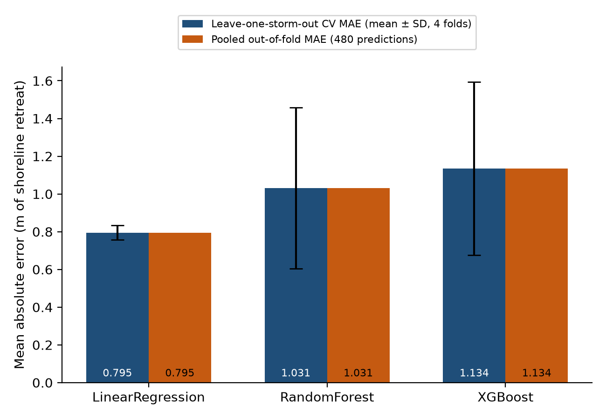
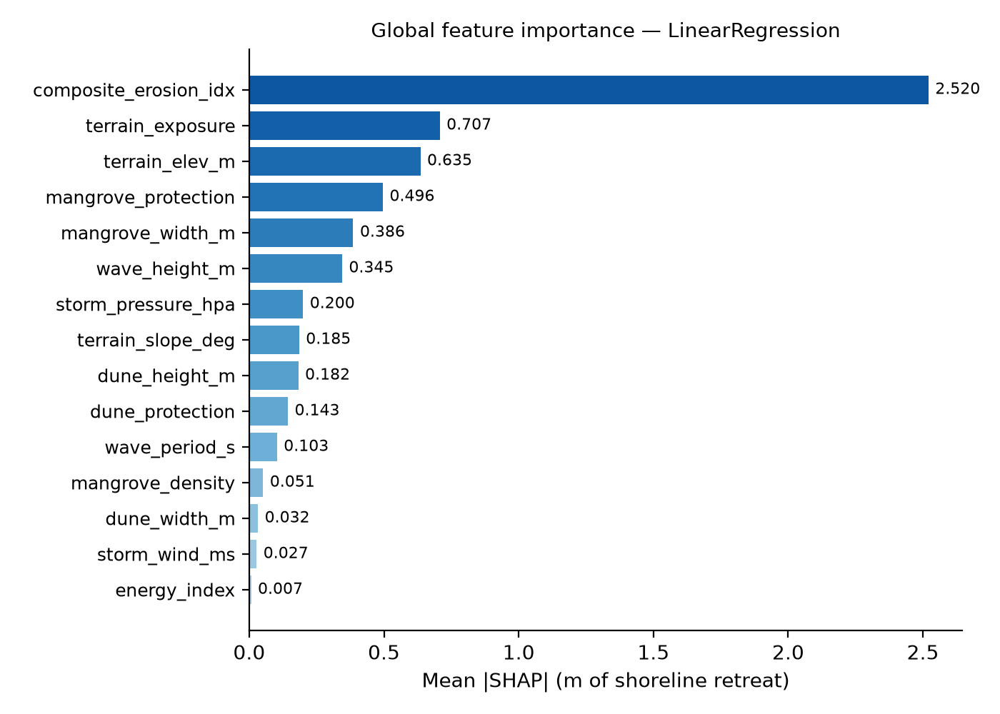
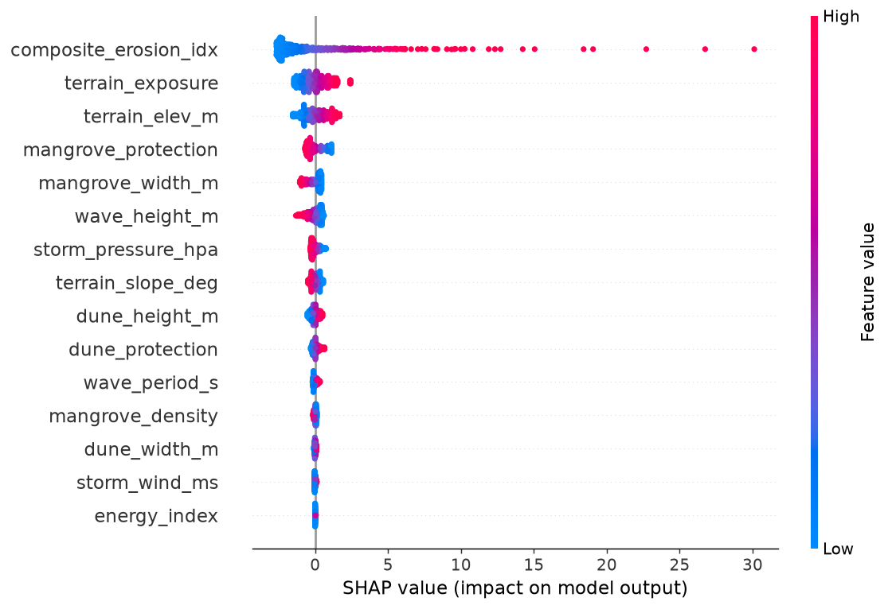
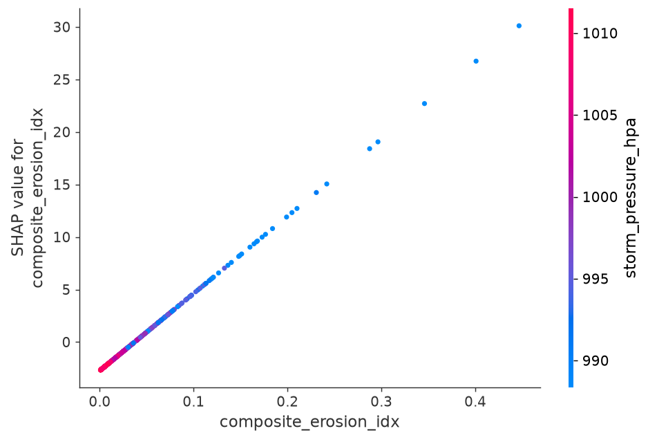
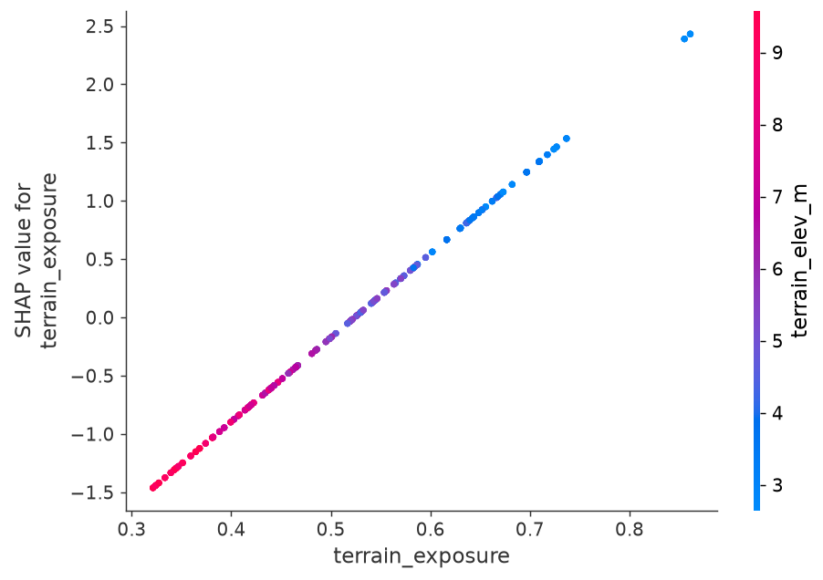
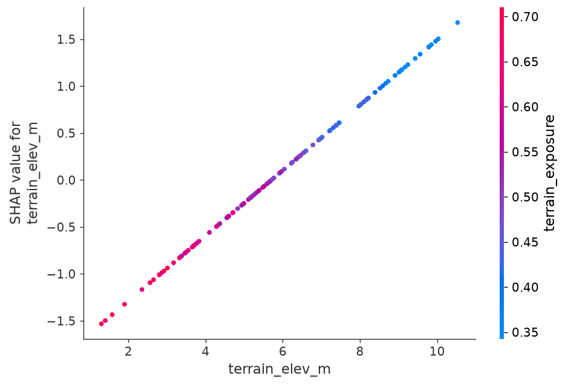

# Coastal Erosion ML Pipeline — Coromandel Coast

A working prototype that implements the full **8-stage shoreline-change architecture**: data acquisition → preprocessing → shoreline extraction → feature engineering → master dataset (SQLite) → ML modeling (Linear Regression / Random Forest / XGBoost) → evaluation (leave-one-storm-out CV, RMSE/MAE/R², SHAP) → outputs (Streamlit dashboard, erosion & buffer maps, decision support).

**Stack:** Python 3.12 · pandas · NumPy · scikit-learn · XGBoost · SHAP · matplotlib · Streamlit · Plotly · SQLite · Shapely

---

## 1. Architecture

```mermaid
flowchart LR
    A[1. Data Acquisition<br/>Sentinel-2 style shores · GMW mangroves ·<br/>IMD cyclone records · ERA5-style waves] --> B[2. Preprocessing<br/>reprojection · clipping ·<br/>cloud-free composite epochs]
    B --> C[3. Shoreline Extraction<br/>NDWI thresholding · pre/post-cyclone<br/>waterlines · DSAS-style transects ·<br/>retreat per coastal section]
    C --> D[4. Feature Engineering<br/>mangrove width/density · dune height/width ·<br/>storm wind/pressure · wave height/period ·<br/>terrain elevation/slope + derived indices]
    D --> E[5. Master Dataset<br/>section × storm table ·<br/>features X · target: retreat y ·<br/>SQLite + CSV · QC gate]
    E --> F[6. ML Modeling<br/>LinearRegression · RandomForest ·<br>XGBoost · leave-one-storm-out CV]
    F --> G[7. Evaluation<br/>RMSE · MAE · R² · best-model selection ·<br/>SHAP summary + dependence plots ·<br/>global feature importance]
    G --> H[8. Outputs<br/>erosion prediction · erosion & buffer maps ·<br/>Streamlit dashboard · decision support]
```



Stages 1–5 are deterministic and seeded (`RANDOM_SEED = 42`), so the master dataset is
reproducible bit-for-bit. Stage 3's geometry code lives in the legacy scripts
(`coastline.py`, `chennai.py`, `demo_run.py`); the ML pipeline consumes the master table.

## 2. The Pipeline Modules

| Stage | File | Responsibility | Notes |
|---|---|---|---|
| Config | `coastml/config.py` | Study area polyline (Chennai → Point Calimere, 120 sections), 4 real cyclones, feature schema, QC bounds | Single source of truth |
| 1–5 Dataset | `coastml/dataset.py` | Builds the clean section × storm master table; QC gate (nulls, duplicates, bounds, row count); stores SQLite + CSV | Mangrove field anchored to **real GMW 2020 polygon** (`out/chennai/mangrove/mangrove_gmw_2020.geojson`); delta belt synthetic |
| 6–7 Modeling | `coastml/models.py` | LinReg / RF / XGBoost, leave-one-storm-out CV, timing metrics, SHAP explanations, publication-style figures, pickled models | Best model selected by LOSO RMSE |
| 8 Outputs | `coastml/app.py` | Streamlit dashboard: dataset, model performance, explainability, prediction & decision support, erosion maps | Reactive to sidebar model/storm |

Legacy Sentinel-2 / Earth Engine extraction scripts (pre-ML work): `coastline.py`
(Cyclone Gaja, NDWI waterlines + DSAS transects), `chennai.py` (Chennai coast, mangrove vs
non-mangrove sections), `prestorm.py`, `demo_run.py` (offline synthetic dry run).

## 3. Dataset

**Master table** (`data/master.db` → `master_dataset`, also `data/master_dataset.csv`):
480 rows = **120 coastal sections × 4 cyclones** (Vardah 2016, Gaja 2018, Nivar 2020,
Michaung 2023), 22 columns, unique key `(section_id, storm)`.

| Group | Columns |
|---|---|
| IDs | `section_id`, `lat`, `lon`, `storm`, `storm_date`, `year` |
| Mangrove | `mangrove_width_m` (GMW-anchored), `mangrove_density` |
| Dune | `dune_height_m`, `dune_width_m` |
| Storm | `storm_wind_ms`, `storm_pressure_hpa` (alongshore decay from landfall) |
| Wave | `wave_height_m`, `wave_period_s` |
| Terrain | `terrain_elev_m`, `terrain_slope_deg` |
| Derived indices | `energy_index`, `mangrove_protection`, `dune_protection`, `terrain_exposure`, `composite_erosion_idx` |
| Target | `shoreline_retreat_m` |

**QC gate** (`outputs/dataset_qc.json`): 0 nulls, 0 duplicate keys, all values inside
physical bounds, expected row count — ✅ PASS. Build fails (exit 1) if any check fails.

## 4. Results (leave-one-storm-out CV)

| Model | RMSE (m) ↓ | MAE (m) ↓ | R² ↑ | Train (s) ↓ | 1-pred (ms) ↓ |
|---|---|---|---|---|---|
| **LinearRegression** 🏆 | **1.01** | **0.80** | **0.935** | **0.01** | **0.03** |
| RandomForest | 2.09 | 1.03 | 0.722 | 0.66 | 12.0 |
| XGBoost | 2.16 | 1.13 | 0.702 | 2.64 | 0.32 |

Per-storm held-out R²: Vardah **0.970** / Gaja 0.748 / Nivar 0.877 / Michaung 0.819
(LinearRegression). Linear wins because retreat is near-linear in
`composite_erosion_idx` after feature engineering, so it extrapolates to unseen storms
while tree models saturate at their training range.

### 4.1 Which model works better — MAE comparison



### 4.2 Global feature importance — mean |SHAP| (best model)



| Rank | Feature | Mean absolute SHAP value (m of retreat) |
|---|---|---|
| 1 | composite_erosion_idx | 2.520 |
| 2 | terrain_exposure | 0.707 |
| 3 | terrain_elev_m | 0.635 |
| 4 | mangrove_protection | 0.496 |
| 5 | mangrove_width_m | 0.386 |

### 4.3 SHAP beeswarm summary — best model (LinearRegression)



### 4.4 SHAP dependence plots — top-3 drivers (best model)







Equivalent figures for RandomForest and XGBoost (`shap_summary_<model>.png`,
`shap_dependence_<model>_<feature>.png`) plus raw numbers (`model_metrics.csv/.json`,
`loso_per_storm.csv`, `feature_importance.csv`, `predictions_loso.csv`,
`shap_plots.json`, `dataset_qc.json`) are in `outputs/`.

## 5. Project Structure

```
Coastline/
├── coastml/
│   ├── config.py            # study area, storms, schema, bounds, paths
│   ├── dataset.py           # stages 1-5: generator + GMW anchor + QC + SQLite/CSV
│   ├── models.py            # stages 6-7: LOSO CV, metrics, SHAP, paper plots
│   └── app.py               # stage 8: Streamlit dashboard (5 tabs)
├── data/
│   ├── master.db            # SQLite master dataset (section × storm)
│   └── master_dataset.csv
├── outputs/                 # metrics, QC report, SHAP + paper figures, models/*.pkl
├── out/                     # legacy extraction artifacts (Gaja/Chennai geojson, tables)
│   └── chennai/mangrove/    # real GMW 2020 mangrove polygon + classified sections
├── coastline.py / chennai.py / prestorm.py / demo_run.py   # legacy EE extraction
└── README.md
```

## 6. Running Locally

```bash
cd Coastline
python3 -m venv .venv && source .venv/bin/activate
pip install pandas scikit-learn matplotlib streamlit plotly xgboost shap shapely

# 1. build the clean master dataset (SQLite + CSV + QC gate)
python -m coastml.dataset

# 2. train models, LOSO CV, SHAP + publication figures
python -m coastml.models

# 3. launch the dashboard
streamlit run coastml/app.py        # http://localhost:8501
```

macOS note: XGBoost needs the OpenMP runtime — `brew install libomp` if the import fails.
Steps 1–2 are idempotent and seeded; re-running reproduces identical artifacts.

## 7. Dashboard Guide

| Tab | What you can do |
|---|---|
| 📊 Dataset | QC badge, row/section/storm counts, retreat box plots by storm, section map, raw table |
| 🏆 Model performance | LOSO metrics table (selected model highlighted), R²/RMSE/MAE bars, latency, per-storm R² heatmap, **MAE comparison figure**, out-of-fold parity plots |
| Explainability | Importance bar chart, **mean \|SHAP\| bar figure**, beeswarm summary, top-3 SHAP dependence plots — all follow the sidebar model |
| 🎯 Prediction & decision support | Pick section + scenario sliders (wind, wave, mangrove width) → predicted retreat, risk class, recommended buffer (1.5× + 10 m), top-10 risk sections |
| 🗺️ Erosion maps | Predicted-retreat & buffer map per storm, predicted-vs-observed by section, mean retreat per storm |

The sidebar (model, storm) plus the model card above the tabs update **every** tab
instantly, including each model's top-5 key drivers.

## 8. Design Rules Followed

1. One config module is the single source of truth (area, storms, schema, bounds).
2. Derived features computed once (`derive_features`) and shared by generator and UI.
3. The dataset passes an explicit QC gate before storage; build fails loudly otherwise.
4. Model comparison uses honest generalization: leave-one-storm-out, pooled out-of-fold
   predictions — no in-sample scores presented as performance.
5. Real data used where available (GMW 2020 mangroves, real cyclone parameters);
   synthetic parts are labelled in code comments and this README.
6. Every artifact (metrics, figures, models, QC) is written to `outputs/` for reuse.
7. The dashboard degrades gracefully: missing figures fall back to tables/captions.

## 9. Future Improvements

- Replace simulated shores with real Sentinel-2 NDWI waterlines via Earth Engine
  (`coastline.py` already implements the extraction; needs EE auth).
- Add DSAS-style long-term rates (EPR/NSM) over 2015–2025 as extra targets.
- Real ERA5 / INCOIS wave and IMD best-track wind fields instead of decay-model forcing.
- GMW tiles for the delta (Pichavaram) so the southern mangrove belt is also real.
- Probabilistic predictions (quantile regression) for buffer-zone confidence intervals.
- Persist dashboard scenario runs to SQLite for auditability.
